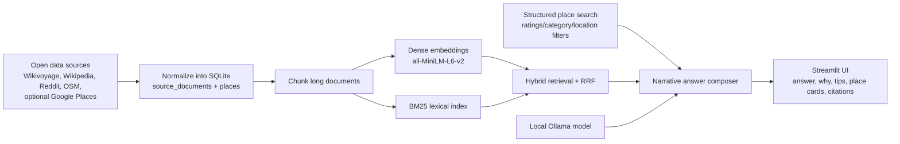

# LocalLens

LocalLens is a local-first RAG assistant for travelers and recent movers. It combines open travel guides, local forum threads, structured place records, and optional Google Places enrichment to answer questions like:

- `What should I know before moving to Seattle?`
- `Where is a good sunset spot in San Francisco?`
- `Best taco place in San Jose over 4.5?`
- `Can I rely on public transit in Chicago?`

## Architecture



## Data Sources

Default open-source pipeline:

- `Wikivoyage`: sectioned city/park guide content for activities, transit, food, safety, lodging
- `Wikipedia`: summaries and thumbnail images for orientation and visual context
- `Reddit`: city-subreddit travel/local threads with top comments
- `OpenStreetMap / Overpass`: structured places for restaurants, parks, museums, attractions, hotels, viewpoints, and transit nodes

Optional enrichment:

- `Google Places API`: live ratings, review counts, and place metadata for queries like `best taco place in san jose over 4.5`
- `NPS API`: optional national-park metadata if you add a key

## Project Layout

```text
LocalLens/
├── app.py
├── artifacts/
├── data/
│   ├── processed/
│   └── raw/
├── docs/
├── scripts/
├── src/locallens/
├── .env.example
├── Dockerfile
├── docker-compose.yml
└── requirements.txt
```

## Quickstart

### 1. Install

```bash
git clone https://github.com/anusha24-bit/LocalLens.git
cd LocalLens
python3 -m venv .venv
source .venv/bin/activate
python3 -m pip install --upgrade pip
python3 -m pip install -r requirements.txt
```

### 2. Configure environment

```bash
cp .env.example .env
```

Minimum recommended `.env` values:

```bash
OLLAMA_BASE_URL=http://localhost:11434
LOCALLENS_OLLAMA_MODEL=llama3.1:8b-instruct-q4_K_M
LOCALLENS_EMBED_MODEL=sentence-transformers/all-MiniLM-L6-v2
LOCALLENS_RERANK_MODEL=cross-encoder/ms-marco-MiniLM-L-6-v2
REDDIT_USER_AGENT=LocalLens/0.1
GOOGLE_MAPS_API_KEY=
```

### 3. Build the corpus

```bash
python3 scripts/build_corpus.py
python3 scripts/build_index.py
```

Notes:

- The nationwide build fetches travel guides, Wikipedia summaries, Reddit discussions, and OpenStreetMap place records across the LocalLens city catalog.
- On a fresh machine, the full build can take several minutes because it is downloading and normalizing external sources.
- For a quicker local development pass, you can skip Reddit:

```bash
python3 scripts/build_corpus.py --skip-reddit
python3 scripts/build_index.py
```

### 4. Run the app

```bash
PYTHONPATH=src streamlit run app.py
```

## Local Model Setup

LocalLens expects a local generation model served through Ollama.

```bash
ollama pull llama3.1:8b-instruct-q4_K_M
ollama serve
```

The retrieval embeddings and reranker run locally through Python models:

- `sentence-transformers/all-MiniLM-L6-v2`
- `cross-encoder/ms-marco-MiniLM-L-6-v2`

## Google Places Support

If you want rating-sensitive place answers such as `best taco place in san jose over 4.5`, add a `GOOGLE_MAPS_API_KEY`.

The app still works without it, but rating-aware place search is much better with Google Places enabled.

See [docs/gcp_free_tier.md](docs/gcp_free_tier.md) for current Google Cloud and Maps free-tier notes.

## Docker

### Build

```bash
docker build -t locallens .
```

### Run

```bash
docker run --rm -p 8501:8501 \
  -e OLLAMA_BASE_URL=http://host.docker.internal:11434 \
  locallens
```

### Compose

```bash
docker compose up --build
```

## Deployment

### Running locally

The simplest way to run LocalLens on your own machine:

1. Install [Ollama](https://ollama.com) and pull the model:
   ```bash
   ollama pull llama3.1:8b-instruct-q4_K_M
   ollama serve
   ```
2. Build the corpus and index (only needed once, or when you want to refresh data):
   ```bash
   python3 scripts/build_corpus.py
   python3 scripts/build_index.py
   ```
3. Launch the app:
   ```bash
   PYTHONPATH=src streamlit run app.py
   ```
4. Open `http://localhost:8501` in your browser.

### Running with Docker

If you prefer a containerized setup:

```bash
docker compose up --build
```

Then visit `http://localhost:8501`. Ollama must be running on your host machine; the container connects to it via `host.docker.internal:11434`.

### Deploying to a cloud VM (e.g. GCP, AWS, DigitalOcean)

1. Provision a VM with at least **8 GB RAM** (16 GB recommended for smooth inference).
2. Install Ollama, pull your model, and run `ollama serve` on the VM.
3. Clone this repo, build the corpus/index, and start Streamlit:
   ```bash
   PYTHONPATH=src streamlit run app.py --server.port 8501 --server.address 0.0.0.0
   ```
4. Open port `8501` in your firewall/security group rules.
5. (Optional) Put Nginx or Caddy in front of Streamlit for HTTPS.

For Google Cloud specifically, see [docs/gcp_free_tier.md](docs/gcp_free_tier.md) for free-tier tips and setup notes.

## Reproducibility Notes

- `data/processed/locallens.db` is the main SQLite database.
- `artifacts/chunk_embeddings.npy` stores the dense index.
- All ingestion is done with code in `src/locallens/ingestion/`.
- If you change sources or city coverage, rerun:

```bash
python3 scripts/build_corpus.py
python3 scripts/build_index.py
```

## Documentation

- [docs/gcp_free_tier.md](docs/gcp_free_tier.md) — Google Cloud free-tier setup and tips
- [docs/demo_script.md](docs/demo_script.md) — example queries and walkthrough
